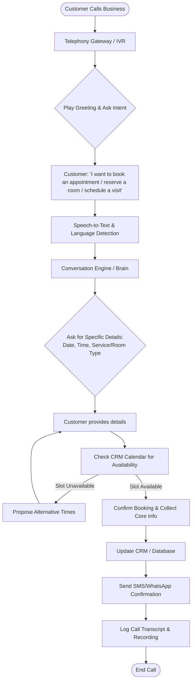
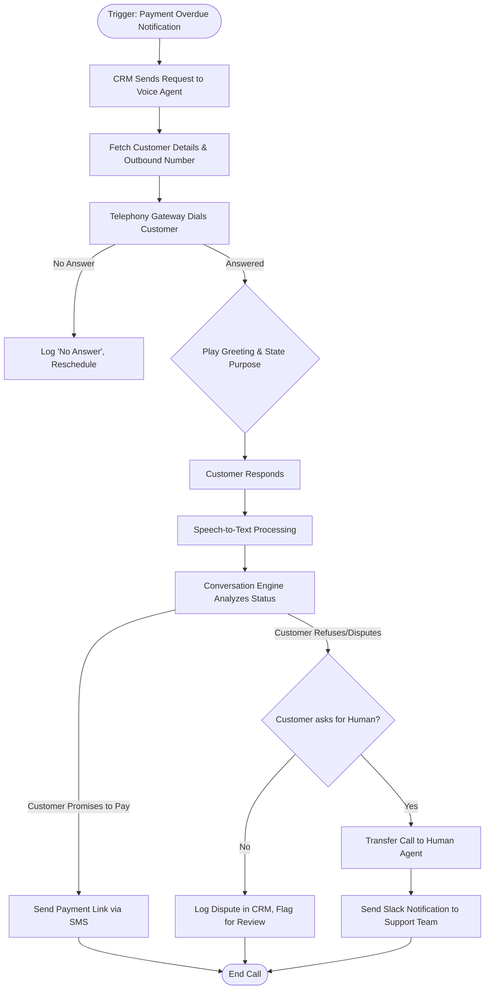

# Codefeast Smart Voice Agent System
## System Design and Product Plan

---

### 1) Layman Explanation 

A service-based business, such as a dental clinic, hotel, salon, real estate agency, or school admissions office, relies heavily on phone communication. Customers call to book appointments, reserve rooms, schedule site visits, or ask for information. Managing this volume of calls traditionally requires a dedicated team of receptionists working continuously.

The Codefeast Smart Voice Agent is a fully automated digital receptionist. It operates continuously without breaks and communicates fluently in over 30 languages, adapting to the specific needs of various service industries.

The system functions through several core components:

* **The Communication Layer:** When a customer calls, the system captures the telephone audio and translates it into text. When responding, it converts its text back into natural, human-sounding speech.
* **The Core Logic Engine:** This is the central processing unit of the system. Instead of using a rigid menu system (e.g., "Press 1 for Sales"), the engine processes natural conversation. For example, if a caller says, "I want to book a haircut for Friday," or "I need to schedule a property site visit," the engine determines the intent and checks the relevant calendar for availability.
* **Industry-Specific Modules:** The core engine adapts its behavior based on the specific business it serves:
  * **Healthcare (Clinics/Hospitals):** Adheres to privacy regulations and handles medical appointments.
  * **Education (Schools/Colleges):** Manages student visits and admissions inquiries.
  * **Hospitality (Hotels):** Handles room reservations, checking dates and room types.
  * **Retail Support (Salons):** Manages service bookings with specific staff members.
  * **Real Estate:** Schedules property showings and directs high-value inquiries to brokers.
* **System Integrations:** Once a decision is reached during the call, the system automates the follow-up tasks. It updates the business calendar or booking software, sends a confirmation message to the customer, and alerts staff internally if necessary.
* **Record Keeping:** Every conversation is transcribed into text and the audio is recorded. These records are securely stored for management to review, ensuring quality of service.

---

### 2) End-to-End Flowcharts

#### Inbound Call Booking Flow (Generic Service-Industry Example)
*This flow dynamically adapts based on the industry (Clinic Appointment, Hotel Room, Salon Service, School Consultation, or Real Estate Visit).*


#### Outbound Call Flow (e.g., Payment Reminder & Escalation)


---

### 3) Architecture Diagram (Atomic Level)

```mermaid
flowchart TB
    subgraph Telephony_Layer ["1. Telephony Layer"]
        TG[Telephony/IVR Gateway]
    end

    subgraph Speech_Processing ["2. Speech & Language Center"]
        LD[Language Detection System]
        STT[Speech-to-Text Controller]
        TTS[Text-to-Speech Controller]
    end

    subgraph Core_Engine ["3. Core Conversation Engine (Multi-Agent System)"]
        RA[Router Module<br/>(Intent Classification)]
        subgraph Industry_Agents
            HA[Healthcare Module]
            EA[Education Module]
            HAA[Hospitality Module]
            SA[Salon Module]
            REA[Real Estate Module]
        end
        OA[Outbound Reminders Module]
        PM[Context Management System]
    end

    subgraph Integrations_Actions ["4. Integrations & Actions"]
        CRM[CRM Update & Sync Module]
        SLK[Slack Notification Service]
        MSG[Email/WhatsApp/SMS Gateway]
    end

    subgraph Data_Storage ["5. Data & Auditing"]
        AD[Audio Blob Storage]
        DB[Metadata & Transcript DB]
        AN[Analytics & Dashboards Backend]
    end

    %% Connections
    TG -->|Audio Stream| LD
    LD -->|Set Context| STT
    STT -->|Transcribed Text| RA
    
    RA -->|Inbound - Appt/Symptom| HA
    RA -->|Inbound - Campus Visit| EA
    RA -->|Inbound - Room Booking| HAA
    RA -->|Inbound - Haircut/Spa| SA
    RA -->|Inbound - Site Visit| REA
    RA -->|Outbound Trigger| OA
    
    HA <-->|Maintain State| PM
    EA <-->|Maintain State| PM
    HAA <-->|Maintain State| PM
    SA <-->|Maintain State| PM
    REA <-->|Maintain State| PM
    OA <-->|Maintain State| PM

    HA -->|Response Text| TTS
    EA -->|Response Text| TTS
    HAA -->|Response Text| TTS
    SA -->|Response Text| TTS
    REA -->|Response Text| TTS
    OA -->|Response Text| TTS

    TTS -->|Synthesized Audio| TG
    
    HA & EA & HAA & SA & REA & OA -->|Execute Action| CRM
    HA & EA & HAA & SA & REA & OA -->|Alert Trigger| SLK
    HA & EA & HAA & SA & REA & OA -->|Send Link| MSG

    TG -.->|Save Recording| AD
    RA & HA & EA & HAA & SA & REA & OA -.->|Save Transcripts & Summaries| DB
    DB <--> AN
```

#### Proposed Multi-Agent Architecture
To handle the complexity of 30+ languages and distinct rules for multiple industries, the system utilizes a modular architecture consisting of 7 primary processing units:

1. **The Router Unit (1)**
   * **Role:** The entry point for all inbound calls. It introduces itself, determines the caller's language, identifies the core intent, and routes the conversation to the appropriate specialized processing unit.
2. **Industry-Specific Inbound Units (5 Core Types)**
   * **Role:** These are highly specialized processing units equipped with specific instructions and integrations for their respective industries.
     * **Healthcare Unit:** Configured for HIPAA compliance, privacy, and medical scheduling.
     * **Education Unit:** Configured to handle campus tours, application deadlines, and course guidance.
     * **Hospitality Unit:** Integrates with Property Management Systems (PMS) for tracking room inventory and dates.
     * **Salon/Retail Unit:** Focuses on service types, staff schedules, and duration of services.
     * **Real Estate Unit:** Automates initial lead screening and property visit scheduling.
3. **The Outbound/Retention Unit (1)**
   * **Role:** A dedicated unit triggered automatically by the business software. It initiates calls to handle payment reminders, initial applicant screening, or sending booking confirmation links.

*Note: Depending on scale, a background monitoring routine runs continuously to measure caller sentiment and interrupt the flow if a caller becomes highly distressed, routing them to a live human operator.*

---

### 4) Data & Storage Plan

**General Assumptions:**
* **Average Call Duration:** 3 minutes
* **Audio Format & Size:** Compressed Opus or MP3 (approx. 1 MB per minute). Total = ~3 MB per call.
* **Transcript Size:** ~10 KB of text per call.
* **Summary/Metadata:** Small JSON objects.

| Data Type | Assumption (Format & Duration) | Estimated Size per Call | Retention Policy | Storage Location / Database Type |
| :--- | :--- | :--- | :--- | :--- |
| **Audio Recording** | Compressed MP3/Opus (3 mins) | ~3 MB | 1-7 years (depending on industry compliance, e.g., Healthcare vs Retail) | Cloud Blob Storage (e.g., AWS S3, Azure Blob) with lifecycle policies. |
| **Full Transcript** | Text/JSON format | ~10 KB | 3-5 years | Relational DB (PostgreSQL) or Document DB (MongoDB). |
| **Summary Notes** | Extracted Key-Value points (JSON) | ~2 KB | 3-5 years | Relational DB (PostgreSQL) - indexed for fast searching. |
| **Booking/Action Metadata** | Timestamps, IDs, Status codes | ~1 KB | 3-5 years (or perpetual if anonymized) | Relational DB (PostgreSQL). |
| **Agent Logs** | System execution logs, latency metrics | ~5 KB | 30-90 days | Log Management Service (e.g., Elasticsearch, AWS CloudWatch). |

---

### 5) Cost & Scaling Analysis

**Underlying Primary Assumptions:**
* **Telephony Cost:** ~$0.015 per minute.
* **Speech Conversion:** ~$0.020 per minute combined.
* **Processing Cost:** ~$0.005 per minute equivalent.
* **Total Processing Cost:** ~$0.04 per minute -> ~$0.12 per average 3-minute call.
* **Storage Cost:** ~$0.023 per GB/month for standard Blob storage.
* *Note: Infrastructure/Fixed costs scale in tiers based on database throughput and support requirements.*

| Cost Component | Small Client (2,000 calls/mo) | Medium Client (20,000 calls/mo) | Large Client (200,000 calls/mo) |
| :--- | :--- | :--- | :--- |
| **Call Minutes Cost (Telephony)** | $90 | $900 | $9,000 |
| **Speech Conversion** | $120 | $1,200 | $12,000 |
| **Processing Cost** | $30 | $300 | $3,000 |
| **Storage Cost** | ~$0.15 (6 GB baseline) | ~$1.50 (60 GB baseline) | ~$15.00 (600 GB baseline) |
| **Support/Monitoring/Infra Cost** | $150 (Basic Cloud Infra) | $500 (Dedicated DBs, Alerts) | $2,000 (HA Setup, Premium Support) |
| **Total Estimated Monthly Cost** | **~$390** | **~$2,901** | **~$26,015** |

*(Cost per call averages to approximately $0.19 for small clients, scaling down to ~$0.13 for large Enterprise clients due to infra amortization).*

---

### 6) Risk & Compliance Considerations

| Risk/Compliance Area | Consideration & Remediation Plan |
| :--- | :--- |
| **1. Consent for Call Recordings** | **Risk:** Eavesdropping laws vary wildly (e.g., Two-party consent in US states, GDPR in Europe).<br/>**Plan:** Embed a mandatory pre-connection IVR prompt: *"This call is recorded for quality purposes; please stay on the line to consent."* Restrict recordings per geo-fence if needed. |
| **2. Opt-out Handling** | **Risk:** Harassment complaints or DND (Do Not Disturb) violations.<br/>**Plan:** The agent must be trained to recognize "stop calling me" or "put me on your do not call list" intents. If triggered, the CRM immediately flags the contact's DND status to block future outbound attempts. |
| **3. Data Retention (PII)** | **Risk:** Holding onto Sensitive Personal Information (SPI) or Patient Health Information (PHI) longer than necessary.<br/>**Plan:** Implement a Data Retention Cron Job. PII in transcripts should be automatically redacted (e.g., hiding credit card numbers via a PII scrubber). Audio recordings should auto-delete based on strict tenant-level retention policies. |
| **4. Security & Access Control** | **Risk:** Unauthorized employees listening to sensitive client calls.<br/>**Plan:** Implement stringent Role-Based Access Control (RBAC). Only authorized managers can view underlying data. Enforce encryption both in transit (TLS 1.2+) and at rest (AES-256). |
| **5. Spam/Outbound Compliance** | **Risk:** Telephone Consumer Protection Act (TCPA) violations or telecom carrier blocks.<br/>**Plan:** Strictly lock outbound pacing and time-of-day logic (no calls outside 9 AM - 6 PM local time). Register verified caller IDs for businesses to avoid automatic "Spam Risk" labeling by telcos. |

---

### 7) MVP Plan and Timeline

**Phase 1 Focus:** Build the core engine in a single primary language with one isolated, high-value use case (e.g., standard appointment bookings) before expanding completely.

| Timeframe | Key Milestone / Goal | MVP Features to Launch | Target Market / Language |
| :--- | :--- | :--- | :--- |
| **Week 1-2** | **Core Execution Engine** | Telephony gateway setup; Speech pipeline integration; Initial processing logic; Audio storage capability. | English only |
| **Month 1** | **Pilot-Ready (Inbound Only)** | Booking integration; Initial Industry Modules (Healthcare, Salons, Hotels, Real Estate, Education); Call transcript storage; Notification system on call completion. | 1 Specific Region / English & Spanish |
| **Month 2** | **Outbound & Scale Expansion** | Automated outgoing calls; Escalation logic; Post-call summary integration. | Adding European markets and India |
| **Month 3** | **Scale-Ready & Analytics** | Redaction/Scrubber for compliance; Dashboard UI for clients to see success rates; Self-serve portal for new businesses. | Global / Multi-lingual |

---
