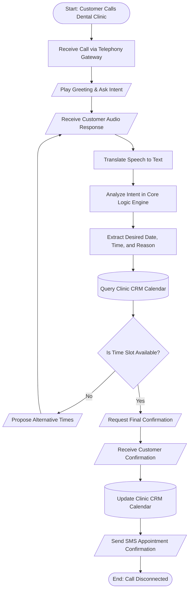
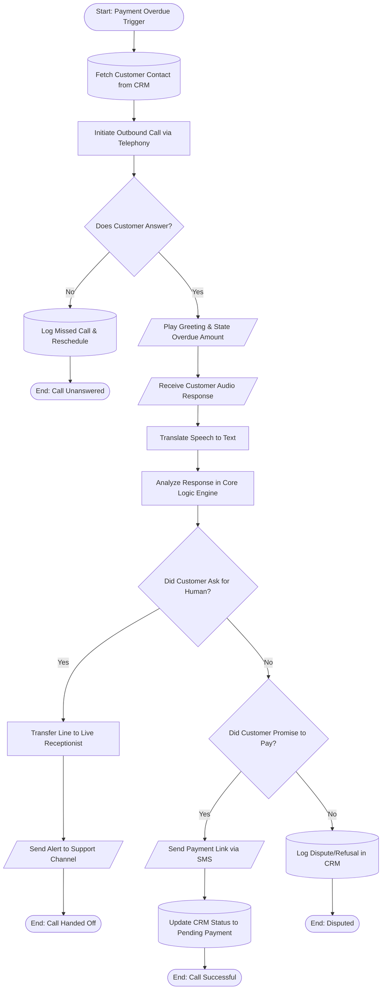

### 2) End-to-End Flowcharts

#### Inbound Call Booking Flow (e.g., Dental Clinic Appointment)

```mermaid
graph TD
    %% Standard Flowchart Symbols: 
    %% ([...]) = Start/End Terminal
    %% [...] = Process
    %% { ... } = Decision
    %% [/ ... /] = Input/Output
    %% [( ... )] = Database
    
    Start([Start: Customer Calls Dental Clinic]) --> Receive[Receive Call via Telephony Gateway]
    Receive --> PlayGreeting[/Play Greeting & Ask Intent/]
    PlayGreeting --> ListenInput[/Receive Customer Audio Response/]
    ListenInput --> SpeechToText[Translate Speech to Text]
    SpeechToText --> ProcessIntent[Analyze Intent in Core Logic Engine]
    ProcessIntent --> ExtractInfo[Extract Desired Date, Time, and Reason]
    ExtractInfo --> QueryDB[(Query Clinic CRM Calendar)]
    QueryDB --> CheckAvailability{Is Time Slot Available?}
    
    CheckAvailability -- No --> ProposeAlternative[/Propose Alternative Times/]
    ProposeAlternative --> ListenInput
    
    CheckAvailability -- Yes --> RequestConfirmation[/Request Final Confirmation/]
    RequestConfirmation --> ListenConfirmation[/Receive Customer Confirmation/]
    ListenConfirmation --> UpdateDB[(Update Clinic CRM Calendar)]
    UpdateDB --> SendSMS[/Send SMS Appointment Confirmation/]
    SendSMS --> EndCall([End: Call Disconnected])
```

#### Outbound Call Flow (e.g., Payment Reminder & Escalation)

```mermaid
graph TD
    %% Standard Flowchart Symbols Used here
    Start([Start: Payment Overdue Trigger]) --> FetchData[(Fetch Customer Contact from CRM)]
    FetchData --> InitCall[Initiate Outbound Call via Telephony]
    InitCall --> CallConnected{Does Customer Answer?}
    
    CallConnected -- No --> LogMissed[(Log Missed Call & Reschedule)]
    LogMissed --> EndCallMissed([End: Call Unanswered])
    
    CallConnected -- Yes --> PlayGreeting[/Play Greeting & State Overdue Amount/]
    PlayGreeting --> ListenInput[/Receive Customer Audio Response/]
    ListenInput --> SpeechToText[Translate Speech to Text]
    SpeechToText --> AnalyzeResponse[Analyze Response in Core Logic Engine]
    AnalyzeResponse --> CheckEscalation{Did Customer Ask for Human?}
    
    CheckEscalation -- Yes --> TransferOperation[Transfer Line to Live Receptionist]
    TransferOperation --> PingSlack[/Send Alert to Support Channel/]
    PingSlack --> EndCallEscalated([End: Call Handed Off])
    
    CheckEscalation -- No --> CheckPromise{Did Customer Promise to Pay?}
    
    CheckPromise -- Yes --> SendLink[/Send Payment Link via SMS/]
    SendLink --> UpdateStatus[(Update CRM Status to Pending Payment)]
    UpdateStatus --> EndCallSuccess([End: Call Successful])
    
    CheckPromise -- No --> LogDispute[(Log Dispute/Refusal in CRM)]
    LogDispute --> EndCallDispute([End: Disputed])
```
