### 3) Architecture Diagram (Atomic Level)

```mermaid
flowchart TB
    subgraph Telephony_Layer ["1. Telephony Layer"]
        TG[Telephony/IVR Gateway]
    end

    subgraph Speech_Processing ["2. Speech & Language Center"]
        LD[Language Detection System]
        STT[Speech-to-Text Controller]
        TTS[Text-to-Speech Controller]
    end

    subgraph Core_Engine ["3. Core Conversation Engine (Multi-Agent System)"]
        RA["Router Module<br/>(Intent Classification)"]
        subgraph Industry_Agents
            HA[Healthcare Module]
            EA[Education Module]
            HAA[Hospitality Module]
            SA[Salon Module]
            REA[Real Estate Module]
        end
        OA[Outbound Reminders Module]
        PM[Context Management System]
    end

    subgraph Integrations_Actions ["4. Integrations & Actions"]
        CRM[CRM Update & Sync Module]
        SLK[Slack Notification Service]
        MSG[Email/WhatsApp/SMS Gateway]
    end

    subgraph Data_Storage ["5. Data & Auditing"]
        AD[Audio Blob Storage]
        DB[Metadata & Transcript DB]
        AN[Analytics & Dashboards Backend]
    end

    %% Connections
    TG -->|Audio Stream| LD
    LD -->|Set Context| STT
    STT -->|Transcribed Text| RA
    
    RA -->|Inbound - Appt/Symptom| HA
    RA -->|Inbound - Campus Visit| EA
    RA -->|Inbound - Room Booking| HAA
    RA -->|Inbound - Haircut/Spa| SA
    RA -->|Inbound - Site Visit| REA
    RA -->|Outbound Trigger| OA
    
    HA <-->|Maintain State| PM
    EA <-->|Maintain State| PM
    HAA <-->|Maintain State| PM
    SA <-->|Maintain State| PM
    REA <-->|Maintain State| PM
    OA <-->|Maintain State| PM

    HA -->|Response Text| TTS
    EA -->|Response Text| TTS
    HAA -->|Response Text| TTS
    SA -->|Response Text| TTS
    REA -->|Response Text| TTS
    OA -->|Response Text| TTS

    TTS -->|Synthesized Audio| TG
    
    HA & EA & HAA & SA & REA & OA -->|Execute Action| CRM
    HA & EA & HAA & SA & REA & OA -->|Alert Trigger| SLK
    HA & EA & HAA & SA & REA & OA -->|Send Link| MSG

    TG -.->|Save Recording| AD
    RA & HA & EA & HAA & SA & REA & OA -.->|Save Transcripts & Summaries| DB
    DB <--> AN
```

#### Proposed Multi-Agent Architecture
To handle the complexity of 30+ languages and distinct rules for multiple industries, the system utilizes a modular architecture consisting of 7 primary processing units:

1. **The Router Unit (1)**
   * **Role:** The entry point for all inbound calls. It introduces itself, determines the caller's language, identifies the core intent, and routes the conversation to the appropriate specialized processing unit.
2. **Industry-Specific Inbound Units (5 Core Types)**
   * **Role:** These are highly specialized processing units equipped with specific instructions and integrations for their respective industries.
     * **Healthcare Unit:** Configured for HIPAA compliance, privacy, and medical scheduling.
     * **Education Unit:** Configured to handle campus tours, application deadlines, and course guidance.
     * **Hospitality Unit:** Integrates with Property Management Systems (PMS) for tracking room inventory and dates.
     * **Salon/Retail Unit:** Focuses on service types, staff schedules, and duration of services.
     * **Real Estate Unit:** Automates initial lead screening and property visit scheduling.
3. **The Outbound/Retention Unit (1)**
   * **Role:** A dedicated unit triggered automatically by the business software. It initiates calls to handle payment reminders, initial applicant screening, or sending booking confirmation links.

*Note: Depending on scale, a background monitoring routine runs continuously to measure caller sentiment and interrupt the flow if a caller becomes highly distressed, routing them to a live human operator.*
