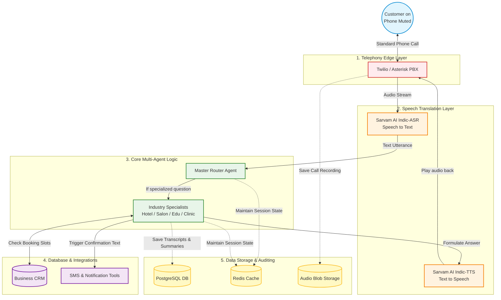

### 3) Architecture Diagram (Simplified & Complete)

Below is a simplified architecture diagram illustrating the core components of the Smart Voice Agent. It shows how an offline caller connects through the Telephony Layer, gets transcribed by Speech AI, reasoned about by our Core Agent Logic, and finally executes real-world tasks and saves data.

### Explaining the Diagram
When communicating this architecture to non-technical stakeholders, use this 5-step explanation:

1. **The Telephony Edge (Red):** The customer picks up their cell phone and makes a standard phone call. Twilio or Asterisk acts as our bridge, answering the phone call and turning it into an audio stream.
2. **Speech Translation (Orange):** We use **Sarvam AI** to act as the "Ears" and "Mouth". The ear (ASR) turns human speech into readable text for the computer. The Mouth (TTS) takes our computer's answer and speaks it in a human-like voice.
3. **Core Multi-Agent Logic (Green):** This is the actual "Brain". It reads the translated text, figures out what the user wants using the **Master Router**, and assigns the task to an **Industry Specialist** (like a Salon Agent or Hotel Agent) equipped with specialized knowledge.
4. **Database & Integrations (Purple):** The "Hands". When the brain decides it's time to book an appointment or answer a question about prices, it reaches into this layer to check real CRM databases or send follow-up text messages.
5. **Data Storage & Auditing (Yellow):** The "Memory". Everything that happens is safely recorded. Short-term memory goes to **Redis**, long-term conversation summaries go to **PostgreSQL**, and the actual audio recordings go to **Audio Blob Storage** for compliance and auditing.
