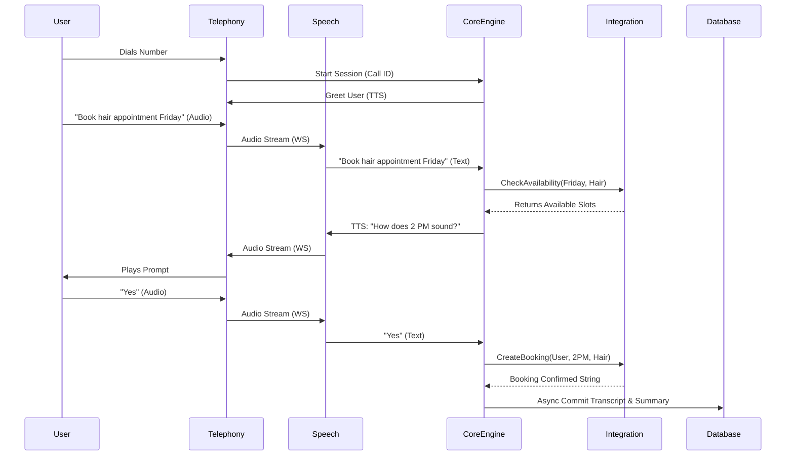

# Low Level Design (LLD) - Codefeast Smart Voice Agent System

## 1. Introduction
This Low Level Design specifies the microservices boundaries, API contracts, data models, and specific technology implementations for the Codefeast Smart Voice Agent. It provides technical detail for engineers implementing the system.

## 2. Microservice Specifications

### 2.1 Telephony Service (Node.js/TypeScript)
* **Purpose:** Handles integration with SIP providers (Twilio/Plivo).
* **Endpoints:**
  * `POST /api/v1/call/inbound`: Receives Twilio Webhook to initiate the TwiML stream.
  * `POST /api/v1/call/outbound`: Initiated by internal Event Bus to trigger a call out.
* **Protocol:** Uses bidirectional WebSockets to stream chunk-based audio to the Speech Service.

### 2.2 Speech Translation Service (Python/FastAPI)
* **Purpose:** The bridge layer between raw audio and text.
* **Flow:**
  * Ingests 16kHz raw audio buffers.
  * Applies VAD (Voice Activity Detection - e.g., Silero VAD) to detect endpoints.
  * Streams chunks to STT engine (e.g., Deepgram or Whisper API).
  * Emits JSON payload `{ "transcript": "text", "confidence": 0.98, "language": "en" }` to the Core Logic Engine.
  * Reverses flow: Takes text from Core Logic Engine, calls TTS provider (e.g., ElevenLabs/Azure), and returns binary audio frames.

### 2.3 Core Logic Engine (Go or Python/Langchain)
* **Purpose:** Evaluates prompts and manages the state machine of the conversation.
* **Routing Logic Map:**
  * **Input:** User Utterance.
  * **Router Processing:** Uses lightweight classifier model to map string -> intent.
  * Routes to specialized handler (e.g., `HealthcareHandler` class).
* **Session Management:**
  * State is serialized and cached in Redis with schema: `call_id: <uuid>, state: { turn_count: int, extracted_entities: {}, current_node: string }`.

### 2.4 Integration Service (Node.js/Express)
* **Purpose:** Normalizes internal requests to external provider schemas (e.g., Epic, Mindbody, generic REST CRMs).
* **Internal API Contracts:**
  * `POST /integration/calendar/checkAvailability` -> `{ start_time, end_time, resource_id }`
  * `POST /integration/calendar/createBooking` -> `{ customer_info, slot_id }`
  * `POST /integration/messaging/sendNotification` -> `{ channel: 'SMS', to: '+1...', template_id }`

### 2.5 Audit & Post-Processing Worker (Python/Celery)
* **Purpose:** Processes heavy offline jobs via Kafka consumer.
* **Jobs:**
  * **PII Redaction:** Runs regex/NER over transcript JSON, replacing card details and SSNs with `[REDACTED]`.
  * **Summarization:** Calls a small LLM to generate a 3-bullet summary of the call.
  * **Storage Commit:** Moves the final clean JSON and finalized `.MP3` blob to long-term storage (S3/PostgreSQL).

## 3. Database Schema Models (PostgreSQL)

### Table: `calls`
| Column | Type | Description |
| :--- | :--- | :--- |
| `id` | UUID (PK) | Unique call identifier |
| `business_id` | UUID (FK) | Reference to tenant/business |
| `direction` | ENUM | INBOUND or OUTBOUND |
| `status` | ENUM | COMPLETED, HANDED_OFF, FAILED |
| `start_time` | TIMESTAMP | Time call initiated |
| `duration_sec` | INT | Total length of call |

### Table: `transcripts`
| Column | Type | Description |
| :--- | :--- | :--- |
| `call_id` | UUID (PK/FK) | Maps 1:1 with call |
| `s3_audio_path` | VARCHAR | URL to cold storage blob |
| `full_text` | JSONB | Array of turns: `[{speaker: 'agent', text: '...'}, {speaker: 'user', text: '...'}]` |
| `summary` | TEXT | Auto-generated summary |
| `is_redacted` | BOOLEAN | Flag ensuring PII scrub occurred |

## 4. Sequence Diagram: Booking Flow

