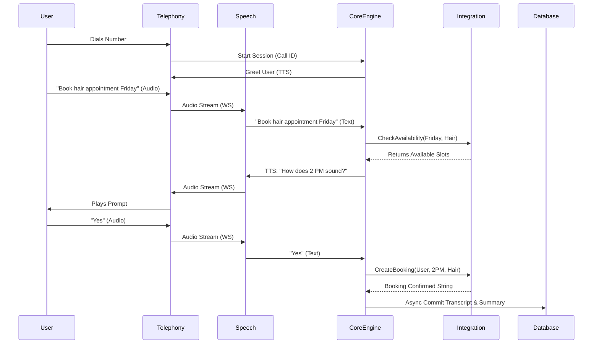

# Low Level Design (LLD) - Codefeast Smart Voice Agent System

## 1. Introduction
This Low Level Design specifies the microservices boundaries, API contracts, data models, and specific technology implementations for the Codefeast Smart Voice Agent. It provides technical detail for engineers implementing the system.

## 2. Microservice Specifications

### 2.1 Telephony Service (FastAPI)
* **Purpose:** Handles integration with SIP providers (Twilio/Asterisk) executing on `app/api/routes.py`.
* **Endpoints:**
  * `POST /api/v1/call/inbound`: Receives Webhook to initiate the streaming stream.
* **Protocol:** Uses bidirectional WebSockets to stream chunk-based audio to the Engine.

### 2.2 Speech Translation Service (Sarvam AI wrapper)
* **Purpose:** The bridge layer between raw audio and text.
* **Flow (`app/services/speech.py`):**
  * Ingests raw audio buffers from the WebSocket chunk.
  * Streams chunks to Sarvam AI Indic-ASR engine.
  * Reverses flow: Takes text from Core Logic Engine, calls Sarvam AI Indic-TTS provider, and returns binary audio frames.

### 2.3 Core Logic Engine (Python / Sarvam LLM)
* **Purpose:** Evaluates prompts and manages the state machine and conversation context map (`app/core/engine.py`).
* **Multi-Agent Routing Logic:**
  * **Input:** User Utterance.
  * **Router Processing:** Uses `RouterAgent` and Sarvam Chat Completion to classify industry intent.
  * Routes to specialized handler (e.g., `HealthcareAgent`, `SalonAgent`).
* **Session Management:**
  * State is serialized and cached in Local Redis via `app/db/redis_cache.py`. Schema: `{ "turn_count": int, "assigned_agent": string, "last_response": string }`.

### 2.4 Integration Service (Python / SQLAlchemy)
* **Purpose:** Normalizes internal requests to the PostgreSQL tables (`app/services/integrations.py`).
* **Core Functions:**
  * `def check_calendar_availability(business_id, date, service_type, industry)`
  * `def create_booking(business_id, caller_number, date, time, service, industry)`

### 2.5 Audit & Post-Processing Worker (Python/Celery)
* **Purpose:** Processes heavy offline jobs via Kafka consumer.
* **Jobs:**
  * **PII Redaction:** Runs regex/NER over transcript JSON, replacing card details and SSNs with `[REDACTED]`.
  * **Summarization:** Calls a small LLM to generate a 3-bullet summary of the call.
  * **Storage Commit:** Moves the final clean JSON and finalized `.MP3` blob to long-term storage (S3/PostgreSQL).

## 3. Database Schema Models (PostgreSQL)

### Table: `calls`
| Column | Type | Description |
| :--- | :--- | :--- |
| `id` | UUID (PK) | Unique call identifier |
| `business_id` | UUID (FK) | Reference to tenant/business |
| `direction` | ENUM | INBOUND or OUTBOUND |
| `status` | ENUM | COMPLETED, HANDED_OFF, FAILED |
| `start_time` | TIMESTAMP | Time call initiated |
| `duration_sec` | INT | Total length of call |

### Table: `transcripts`
| Column | Type | Description |
| :--- | :--- | :--- |
| `call_id` | UUID (PK/FK) | Maps 1:1 with call |
| `s3_audio_path` | VARCHAR | URL to cold storage blob |
| `full_text` | JSONB | Array of turns: `[{speaker: 'agent', text: '...'}, {speaker: 'user', text: '...'}]` |
| `summary` | TEXT | Auto-generated summary |
| `is_redacted` | BOOLEAN | Flag ensuring PII scrub occurred |

## 4. Sequence Diagram: Booking Flow

